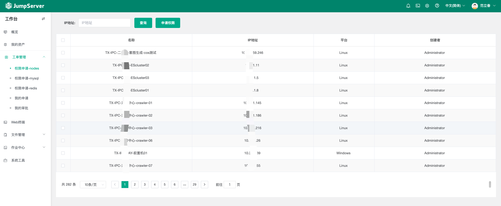
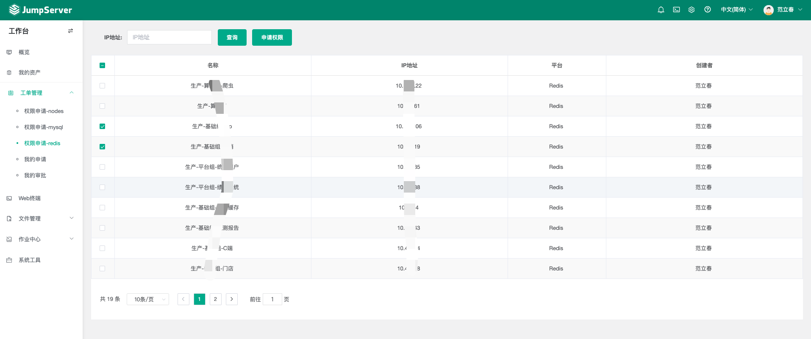

# jumpserver-Ticket

#### 介绍
是在jumpserver(v3.10.9)上面二次开发出了一个简单的工单申请\
用户可以申请服务器和mysql库的权限\
mysql 权限可以细分到库表

自动创建授权，不用人为干预

#### 软件架构
jumpserver core代码
jumpserver lina代码

1. 我这个是基于jumpserver v3.10.9 开发的。
2. 大家可以试试别的版本，基本上只涉及到几个接口
3. 只要这几个接口不变，我这个简单版的工单申请 就可以运行的
4. 只需要在你的版本代码上面 新增几个接口就行
5. 然后前端新增页面就行


#### 前端展示






#### 代码接口介绍
```shell
# 我新增的接口主要有以下几个

# 都是在这个文件里面
jumpserver-ticket/jumpserver-v3.10.9/apps/perms/urls/user_permission.py

# 具体接口


# 自己新增的 工单申请
# 这个接口是获取全部的资产的 
path('mytickets/getassets/', api.mytickets.get_all_node),

# 这个是创建申请服务器的工单接口
path('mytickets/apply/', api.perm_apply.perm_application),

# 这个是创建申请mysql数据库权限的接口
path('mytickets/applydb/', api.perm_apply.perm_application_db),

# 这个是查看自己的工单申请接口
path('mytickets/myapplication/', api.mytickets.my_application),

# 这个是管理员查看并审批 用户申请的接口
path('mytickets/myapproval/', api.mytickets.my_myapproval),

# 对接工单系统

# 这两个接口是因为 我们本身就有工单系统平台。
# 然后我给我们的开发专门写的两个接口

# 这个是创建服务器权限的接口
path('mytickets/createauthnodes/', api.mytickets.create_auth_nodes),
# 这个是创建mysql数据库权限的接口
path('mytickets/createauthmysql/', api.mytickets.create_auth_mysqls),
```


#### 安装教程

安装的话 就按照官网的安装就行\

大概步骤的话：

1. 从官网下载代码，修改代码（下载我的代码）
2. 先编译core代码，docker build -f Dockerfile-ce -t jumpserver/mycore-ce-v3-2:v3.10.9 .\
    最终会编译出一个镜像
3. 编译lina前端代码，yarn build。\
    最终会编译出一个lina目录

部署core：

```shell
# 进入docker compose文件夹
cd /opt/jumpserver-installer-v3.10.8/compose

# 批量替换core镜像
sed -i "s/mycore-ce-v3-1/mycore-ce-v3-2/g" *
cd ..

# 停止服务
./jmsctl.sh stop

# 启动服务
./jmsctl.sh start
```


部署lina:

```shell
# 因为前端打包出来的是一个lina文件夹
# 所以你可以再写一个dockerfile，以原始的lina镜像为基础，把这个文件给编译进去

# 我采用了一种比较最简单的方式 直接把文件复制进去，然后重启nginx
# 但是缺点就是容器重启了 那么你修改的lina代码就没有了，得再复制一遍
# 方式有很多种，看你采用哪种都行

docker cp lina  7309df137aff:/tmp/lina
docker exec -it 7309df137aff bash
rm -rf lina
mv /tmp/lina .

nginx -t
nginx -s reload
```

这样就部署好了


#### 修改配置

1. 下载我的代码
2. 修改连接数据库的账号密码，你得有数据库账号，并且权限是。或者你用root账号也行
```sql
GRANT SELECT, GRANT OPTION, RELOAD, UPDATE, CREATE USER, SHOW DATABASES ON *.* TO 'xxx'@'xxx';
```
3. 你在全局文件里搜 db_user 的行，然后把用户名密码 改成你有权限的用户
4. 然后需要修改调用你本身jumpserver接口的 token。因为我没有完全去读和jumpserver的 代码，所以我这就是取巧。直接在代码里面调用接口\
全局文件搜索 admin_token 的行。然后把token替换成的你token。
5. 具体怎么获取token，查看jumpserver官方文档，要选择private_token的方式。[jumpserver官方文档创建token](https://docs.jumpserver.org/zh/v4/dev/rest_api/#2-api)
6. 然后再按照我上面的安装步骤 就可以了


#### 结语
```
如果有大佬感兴趣的，咱们可以一起交流。
或者有什么问题的，请留言。

就是平时写的一个小功能，愿对大家有用。
一起进步，一起成长！
```

